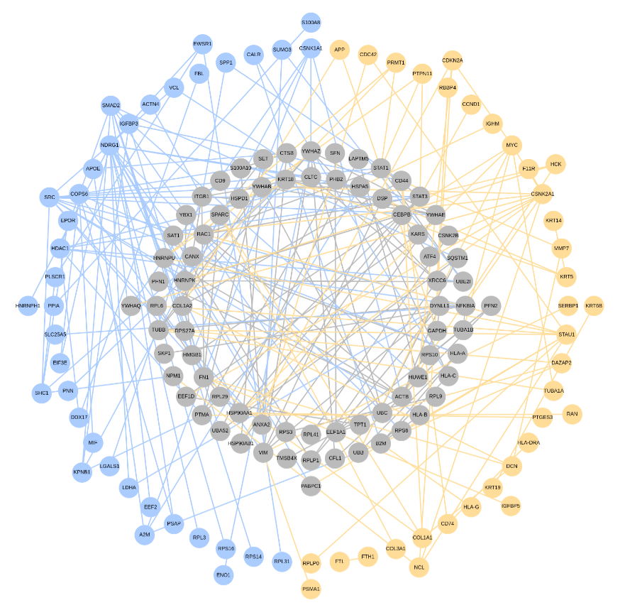

```{r setup, include=FALSE}
knitr::opts_chunk$set(tidy.opts=list(width.cutoff=55,
                                     args.newline = TRUE,
                                     arrow = TRUE),
                      tidy=TRUE)
```

# The NetworkDifferences-Aspect
The `NetworkDifferences` aspect allows the tracking and visualization of the differences of two RCX-objects. The first part of this vignette explains in detail how this aspect works and at the end we take a closer look at how this functionality can be used for a real-life example. Many biological entities like proteins and genes are represented as biological networks with nodes and edges and comparing these networks can help to answer questions in medical research e. g. the real-life example illustrates how the `NetworkDifferences` aspect can be used to visualize the differences regarding genes, gene expression and other aspects of two breast cancer patients. 

The `NetworkDifferences` aspect website is available at https://github.com/frankkramer-lab/RCX-NetworkDifferences  
This package is an extension of the RCX package by Florian Auer. The json-based data structure CX is often used to store biological networks and the RCX package adapts the CX format to standard R data formats to create and modify, load, export, and visualize networks. 
```{r library, echo=FALSE, message=FALSE, include = FALSE}
library(RCXNetworkDifferences)
```
The `NetworkDifferences` aspect tracks the differences of two networks, represented as RCX-objects. First, two RCX-objects `left` and `right` are created that will be used as examples later.
```{r left right}
left <- RCX::createRCX(
    nodes = RCX::createNodes(id=0:2, name=c("A","B","C"), represents=c("r1","r2","r3")),
    edges = RCX::createEdges(source = c(0, 1, 2), target = c(1, 2, 0), interaction = c("E1", "E2", "E3")),
    nodeAttributes = RCX::createNodeAttributes(propertyOf = c(0, 1), name = rep("type", 2), value = list("w", c("x", "y"))),
    edgeAttributes = RCX::createEdgeAttributes(propertyOf = c(0, 1), name = rep("type", 2), value = c("k", "l")),
    networkAttributes = RCX::createNetworkAttributes(name = c("name", "author"), value = c("left network", "Donald Duck"))
)

right <- RCX::createRCX(
    nodes = RCX::createNodes(name = c("A", "B", "X"), represents = c ("r1", "r4", "r5")),
    edges = RCX::createEdges(source = c(0, 1, 2), target = c(1, 2, 0), interaction = c("E1", "E2", "E3")),
    nodeAttributes = RCX::createNodeAttributes(propertyOf = c(0, 1), name = c("type", "type"),value = list("z", c("x", "y"))),
    edgeAttributes = RCX::createEdgeAttributes(propertyOf = c(0, 1), name = rep("type", 2), value = list("n" , c("l", "m"))),
    networkAttributes = RCX::createNetworkAttributes(name = c("name", "description"), value = c("right network", "sample network"))
)
```
Now, we have two RCX-objects and with the `compareNetworks`-function we can track their differences. To illustrate the difference between `matchByName` set to `TRUE` respectively `FALSE`, we define two RCX-objects called `rcxMatchByNameTRUE` and `rcxMatchByNameFALSE`.
```{r compareNetworks}
rcxMatchByNameTRUE <- compareNetworks(left, right, matchByName = TRUE)
rcxMatchByNameFALSE <- compareNetworks(left, right, matchByName = FALSE)
```

## The compareNetworks-function
The `compareNetworks`-function is provided to track the differences regarding the `nodes`, `nodeAttributes`, `edges`, `edgeAttributes`, and `networkAttributes` and has three parameters: the two RCX-objects `left` and `right`, and the boolean `matchByName`. The names `left` and `right` are based on the join-operation. If `matchByName` is `TRUE`, two nodes are equal when their names are equal; if `matchByName` is `FALSE`, two nodes are equal when their represents are equal.

The function returns an RCX network whereby the `nodes`, `nodeAttributes`, `edges`, and `edgeAttributes` of the right network are appended to the corresponding aspects of the left network. The `networkAttributes` are ignored as it is not possible to append the `networkAttributes` of the right network to the `networkAttributes` of the left network if the `networkAttributes` have the same name. An additional aspect called the `NetworkDifferences` aspect is added to the RCX network. It is a list with the `matchByName`-boolean and five dataframes to track the differences of `nodes`, `nodeAttributes`, `edges`, `edgeAttributes`, and `networkAttributes` of the two RCX objects.

The structure of the returned RCX object is:
```
|---nodes: left nodes, right nodes
|---nodeAttributes: left nodeAttributes, right nodeAttributes
|---edges: left edges, right edges
|---edgeAttributes: left edgeAttributes, right edgeAttributes
|---networkDifferences
|   |---matchByName: if nodes are matched by name or represent
|   |---nodes: differences of the nodes
|   |   |---id
|   |   |---name / nameLeft
|   |   |---representLeft / nameRight
|   |   |---representRight / represent
|   |   |---oldIdLeft
|   |   |---oldIdRight
|   |   |---belongsToLeft
|   |   |---belongsToRight
|   |---nodeAttributes: differences of the nodeAttributes
|   |   |---name
|   |   |---propertyOf
|   |   |---belongsToLeft
|   |   |---belongsToRight
|   |   |---dataTypeRight
|   |   |---dataTypeLeft
|   |   |---isListLeft
|   |   |---isListRight
|   |   |---valueLeft
|   |   |---valueRight
|   |---edges: differences of the edges
|   |   |---id
|   |   |---source
|   |   |---target
|   |   |---interaction
|   |   |---oldIdLeft
|   |   |---oldIdRight
|   |   |---belongsToLeft
|   |   |---belongsToRight
|   |---edgeAttributes: differences of the edgeAttributes
|   |   |---name
|   |   |---propertyOf
|   |   |---belongsToLeft
|   |   |---belongsToRight
|   |   |---dataTypeRight
|   |   |---dataTypeLeft
|   |   |---isListLeft
|   |   |---isListRight
|   |   |---valueLeft
|   |   |---valueRight
|   |---networkAttributes: differences of the networkAttributes
|   |   |---name
|   |   |---belongsToLeft
|   |   |---belongsToRight
|   |   |---dataTypeRight
|   |   |---dataTypeLeft
|   |   |---isListLeft
|   |   |---isListRight
|   |   |---valueLeft
|   |   |---valueRight
```

### The combined RCX network
The combined network adds the aspects of the right network to the left network. For the `nodes` it is:
```{r nodes}
rcxMatchByNameTRUE$nodes
```
The the `nodeAttributes` have updated values for `propertyOf` for `nodeAttributes` originating from the right network.
```{r nodeAttributes}
rcxMatchByNameTRUE$nodeAttributes
```
The dataframe for the `edges` contains updated values for `source` and `target` for `edges` originating from the right network.
```{r edges}
rcxMatchByNameTRUE$edges
```
The last aspect are the `edgeAttributes`, again with updated values for `propertyOf` for the `edgeAttributes` originating from the right network.
```{r edgeAttributes}
rcxMatchByNameTRUE$edgeAttributes
```
### The networkDifferences-aspect
The `NetworkDifferences`-aspect contains the information regarding the differences of `nodes`, `nodeAttributes`, `edges`, `edgeAttributes`, and `networkÀttributes`.

**The nodes-dataframe**

The `nodes`-dataframe tracks the differences of the `nodes` in eight columns. The names of the columns depend on the `matchByName`-boolean. If `matchByName` is `TRUE` the names of the columns are: `id`, `name`, `representLeft`, `representRight`, `oldIdLeft`, `oldIdRight`, `belongsToLeft`, and `belongsToRight`. If `matchByName` is `FALSE` the names of the columns are: `id`, `name`, `representLeft`, `representRight`, `oldIdLeft`, `oldIdRight`, `belongsToLeft`, and `belongsToRight`.

*Example:* The left network has three nodes called A, B, and C with the represents r1, r2, and r3. 
```{r left nodes}
left$nodes
```
The right network has three nodes called A, B, and X with the represents r1, r4, and r5.
```{r right nodes}
right$nodes
```
If `matchByName` is `TRUE`, the created `nodes`-dataframe of the `networkDifferences` aspect is:
```{r mbnTRUE nodes}
rcxMatchByNameTRUE$networkDifferences$nodes
```
If `matchByName` is `FALSE`, the created `nodes`-dataframe is:
```{r mbnFALSE nodes}
rcxMatchByNameFALSE$networkDifferences$nodes
```

**The nodeAttributes-dataframe**

The `nodeAttributes`-dataframe tracks the differences of the `nodeAttributes` in ten columns (`propertyOf`, `name`, `belongsToLeft`, `belongsToRight`, `dataTypeLeft`, `dataTypeRight`, `isListLeft`, `isListRight`, `valueLeft`, and `valueRight`). Two `nodeAttributes` are equal if their `names` are equal and if they belong to the same node (defined through `propertyOf`). 

*Example:* The nodes from section 1.2.1 have `nodeAttributes`: In both RCX-objects, the nodes with the id 0 and 1 have the attribute 'type'.
```{r left nodeAttributes}
left$nodeAttributes
```
```{r right nodeAttributes}
right$nodeAttributes
```
If `matchByName` is `TRUE`, the `nodeAttributes`-dataframe of the `networkDifferences` aspect is:
```{r mbnTRUE nodeAttributes}
rcxMatchByNameTRUE$networkDifferences$nodeAttributes
```
If `matchByName` is `FALSE`, the `nodeAttributes`-dataframe is:
```{r mbnFALSE nodeAttributes}
rcxMatchByNameFALSE$networkDifferences$nodeAttributes
```

**The edge-dataframe**

The `edges`-dataframe tracks the differences of the `edges` in eight columns (`id`, `source`, `target`, `interaction`, `oldIdLeft`, `oldIdRight`, `belongsToLeft`, and `belongsToRight`). Two `edges` are equal if their `source` and `target` are equal (the `edges` are undirected so `source` and `target` can be switched) and if the `interaction` is equal or `NA` in both cases.

*Example:* Both RCX-objects from section 1.2.1 and 1.2.2 have three edges which have the `interactions` 'E1', 'E2', and 'E3'. 
```{r left edges}
left$edges
```
```{r right edges}
right$edges
```
If `matchByName` is set to `TRUE`, the `edges`-dataframe of the `networkDifferences` aspect is:
```{r mbnTRUE edges}
rcxMatchByNameTRUE$networkDifferences$edges
```
If `matchByName` is set to `FALSE`, the `edges`-dataframe is:
```{r mbnFALSE edges}
rcxMatchByNameFALSE$networkDifferences$edges
```

**The edgeAttributes-dataframe**

The `edgeAttributes`-dataframe tracks the differences of the `edgeAttributes` in ten columns (`propertyOf`, `name`, `belongsToLeft`, `belongsToRight`, `dataTypeLeft`, `dataTypeRight`, `isListLeft`, `isListRight`, `valueLeft`, and `valueRight`). Two `edgeAttributes` are equal if their `names` are equal and if they belong to the same edge (defined through `propertyOf`).

*Example:* The edges from section 1.2.3 have edgeAttributes: In both RCX-objects, the edges with the id 0 and 1 have the attribute 'type'.
```{r left edgeAttributes}
left$edgeAttributes
```
```{r right edgeAttributes}
right$edgeAttributes
```
If `matchByName` is `TRUE`, the `edgeAttributes`-dataframe of the `networkDifferences` aspect is:
```{r mbnTRUE edgeAttributes}
rcxMatchByNameTRUE$networkDifferences$edgeAttributes
```
If `matchByName` is `FALSE`, the `edgeAttributes`-dataframe is:
```{r mbnFALSE edgeAttributes}
rcxMatchByNameFALSE$networkDifferences$edgeAttributes
```

**The networkAttributes-dataframe**

The `networkAttributes`-dataframes tracks the differences of the `networkAttributes` in nine columns (`name`, `belongsToLeft`, `belongsToRight`, `dataTypeLeft`, `dataTypeRight`, `isListLeft`, `isListRight`, `valueLeft`, and `valueRight`). Two `networkAttributes` are equal if their `names` are equal. 

*Example:* The left and right RCX-objects have networkAttributes: the left RCX-object has the name 'left network' and the author 'Donald Duck'. 
```{r left networkAttributes}
left$networkAttributes
```
The right RCX-object has the name 'right network' and the description 'sample network'.
```{r right networkAttributes}
right$networkAttributes
```
The `networkAttributes`-dataframe of the `networkDifferences` aspect is:
```{r mbn networkAttributes}
rcxMatchByNameTRUE$networkDifferences$networkAttributes
```

## The JSON-Conversion
The RCX objects including the `NetworkDifferences` aspect can be converted into the json-based CX format and back in order to share the object. To convert the RCX object into CX, the `toCX` function from the RCX package is used.
```{r rcxToJSON}
json = RCX::toCX(rcxMatchByNameTRUE, verbose = TRUE)
json
```
The re-conversion is the responsibility of the function `processCX` but before the json-string has to be parsed. This RCX object is printed and it is identical to the original RCX object.
```{r JSONToRcx}
jsonParsed = RCX:::parseJSON(json)
rcx = RCX:::processCX(jsonParsed, verbose = TRUE)
rcx
```

## The Conversion to RCX-objects
The `NetworkDifferences` aspect can be converted to RCX-objects in order to visualize the differences of the RCX-objects `left` and `right`. There are three options: node-centered, edge-centered and a combined version. The user can decide if the names and the values of the `node-` or `edgeAttributes` should be included. The `networkAttributes` are not visualized as they are not considered to be important.

The elements that exist in both RCX-objects are colored gray, the elements that exist only in the left RCX-object are colored light blue and the elements that exist only in the right RCX-object are orange.
The shapes for the nodes are: 

| RCX Element           | Shape                         |
| ----------------------|-------------------------------|
| node names            | round                         |
| node represents       | triangle                      |
| edge                  | rectangle                     |
| nodeAttributes name   | hexagon                       |
| nodeAttribute value   | parallelogram                 |
| edgeAttribute name    | rectangle with round corners  |
| edgeAttribute value   | diamond                       |

### Node-centered RCX-objects
With the node-centered RCX-objects the user can visualize the differences of the two given RCX-objects regarding the `nodes` and, if wished, the names and values of the `nodeAttributes`. The `exportDifferencesToNodeNetwork`-function has the `includeNamesAndRepresents`-parameter; if this parameter is set to `FALSE`, either the `represents` or the `names` are visualized (depending on `matchByName`); if `includeNamesAndRepresents` is set to `TRUE`, both `names` and `represents` are visualized.

The position of the circles can be changed with several parameters:

* `startLayerBoth` has the default value 5 and determines the position at which the circles for the nodes that belong to both RCX-objects start 

* `startLayerLeftRight` has the default value 10 and determines the position at which the circles for the nodes that belong only to one RCX-objects start (it must be greater than `startLayerLeftRight`). The nodes that belong to the left network are in the left half and the nodes of the right network are located in the right half.

* `startLayerAttributes` has the default value 0 and if this parameter is greater than `startLayerLeftRight`, it determines the position at which the circles for the names of the nodeAttributes start. The nodeAttributes that belong to both networks are located in the upper half of the circles, the nodeAttributes that belong to the left respectively right network are located in the lower left/right network.

* `startLayerValues` has the default value 0 and if this parameter is greater than `startLayerAttributes`, it determines the position at which the circles for the values of the nodeAttributes start. The values of the nodeAttributes that belong to both networks are located in the upper half (there can be one gray node if the values are equal in both networks or two nodes (blue and orange) if the values are different), the values of nodeAttributes that belongs only to one network are located in the lower left / right sector.

The following figure shows the the differences of the RCX-objects from the section 1.2 with `matchByName` set to `TRUE`.

```{r mbnTRUE nodeNetwork}
nodeNetwork = exportDifferencesToNodeNetwork(rcxMatchByNameTRUE$networkDifferences, includeNamesAndRepresents = FALSE, startLayerBoth = 1, startLayerLeftRight = 2, startLayerAttributes = 3, startLayerValues = 4)
visualize(nodeNetwork)
```
{width=100%}
The next figure shows the result if `matchByName` is set to `FALSE`.
```{r mbnFALSE nodeNetwork}
nodeNetwork = exportDifferencesToNodeNetwork(rcxMatchByNameFALSE$networkDifferences, includeNamesAndRepresents = FALSE, startLayerBoth = 1, startLayerLeftRight = 2, startLayerAttributes = 3, startLayerValues = 4)
visualize(nodeNetwork)
```
{width=100%}
The last figure shows the results if `matchByName` and `includeNamesAndRepresents`are `TRUE`.
```{r mbnTRUE NodeNetworkRepr}
nodeNetwork = exportDifferencesToNodeNetwork(rcxMatchByNameTRUE$networkDifferences, includeNamesAndRepresents = TRUE, startLayerBoth = 1, startLayerLeftRight = 2, startLayerAttributes = 3, startLayerValues = 4)
visualize(nodeNetwork)
```
{width=100%}

### Edge-centered RCX-objects
With the edge-centered RCX-objects the user can visualize the differences of the two given RCX-objects regarding the `edges` and, if wished, the names and values of the `edgeAttributes`. Like before, there are the parameters `startLayerBoth`, `startLayerLeftRight`, `startLayerAttributes`, and `startLayerValues` to define the position of the nodes representing the `edges` and the names and values of the `edgeAttributes` (for more details see section 2.1).

The following figure shows the edge-centered RCX-object if `matchByName` is `TRUE`.
```{r mbnTRUE edgeNetwork}
edgeNetwork = exportDifferencesToEdgeNetwork(rcxMatchByNameTRUE$networkDifferences, startLayerBoth = 1, startLayerLeftRight = 2, startLayerAttributes = 3, startLayerValues = 4)
visualize(edgeNetwork)
```
{width=100%}
The next figure shows the result if `matchByName` is `FALSE`.
```{r mbnFALSE edgeNetwork}
edgeNetwork = exportDifferencesToEdgeNetwork(rcxMatchByNameFALSE$networkDifferences, startLayerBoth = 1, startLayerLeftRight = 2, startLayerAttributes = 3, startLayerValues = 4)
visualize(edgeNetwork)
```
{width=100%}
### Node- and edge-centered RCX-objects
The last option are the creation of RCX-Objects that show the differences regarding the `nodes`, the `edges`, and the `node-` and `edgeAttributes`. The parameters are the same as for the node-centered option (section 2.1).

The following figure shows the node- and edge-centered RCX-object for the RCX-objects from section 1 with `node-` and `edgeAttributes` (`matchByName` is `TRUE`).
```{r mbnTRUE nodeEdgeNetwork}
nodeEdgeNetwork = exportDifferencesToNodeEdgeNetwork(rcxMatchByNameTRUE$networkDifferences, startLayerBoth = 1, startLayerLeftRight = 2, startLayerAttributes = 3, startLayerValues = 4)
visualize(nodeEdgeNetwork)
```
{width=100%}
The last figure shows the RCX-objects but without the `node-` and `edgeAttributes`.
```{r mbnTRUE nodeEdgeNetworkRepr}
nodeEdgeNetwork = exportDifferencesToNodeEdgeNetwork(rcxMatchByNameTRUE$networkDifferences, startLayerBoth = 1, startLayerLeftRight = 2, startLayerAttributes = 0, startLayerValues = 0)
visualize(nodeEdgeNetwork)
```
{width=100%}

# Real-life example
The example from section 1 illustrates how the differences of the two RCX-objects are tracked and visualized. This section shows how this can be applied to a real life example whereby the two RCX objects represent breast cancer patients.
The two RCX-objects can be extracted from the "Combined patient-specific breast cancer subnetworks" (UUID a420aaee-4be9-11ec-b3be-0ac135e8bacf on NDEx) and they show the networks of two breast cancer patients. These networks have nodes that represent genes, edges between the nodes, and nodeAttributes for the gene expression, gene expression level, and relevance score whereby the patient id is part of the name of the nodeAttributes. On the basis of the names of the nodeAttributes the corresponding nodes and then the edges can be extracted. At the end, the patient ids are removed from the name of the nodeAttributes.
The patient with the ID GSM615195 and the patient with the ID GSM615184 are selected for this example whereby the patient GSM615195 has developed metastasis within the first five years after the cancer diagnosis and patient GSM615184 remained metastasis-free. We filter the nodeAttributes and only focus on the gene expression level. Visualizing the differences of two patients can help to determine the reasons for the metastasis-development.

```{r realLife subnetworks, tidy=FALSE}
library(stringr)

rcx = readCX("/home/n/Augsburg/Bachelorarbeit/Combined patient-specific breast cancer subnetworks.cx")

getNetwork <- function(
        patientID = NULL,
        rcx = NULL,
        filterNodeAttributes = ""
) {
    nodes <- rcx$nodes
    edges <- rcx$edges
    nodeAttributes <- rcx$nodeAttributes[startsWith(rcx$nodeAttributes$name, patientID),]
    nodeID <- c()
    for (i in 1:nrow(nodeAttributes)) {
        row = nodeAttributes[i,]
        if (startsWith(row$name, patientID)) {
            propID = row$propertyOf
            if (!(propID %in% nodeID)) {
                nodeID = append(nodeID, propID)
            }
        }
    }
    nodes = subset(nodes, id %in% nodeID)
    nodeAttributes <- subset(nodeAttributes, propertyOf %in% nodeID)
    for (i in 1:nrow(nodeAttributes)) {
        nodeAttributes[i,]$name <- str_remove(nodeAttributes[i,]$name, paste(patientID, "_", sep = ""))
    }
    if (nchar(filterNodeAttributes) > 0) {
        nodeAttributes <- nodeAttributes[nodeAttributes$name == filterNodeAttributes,]
    }
    edgeID <- c()
    for (i in 1:nrow(rcx$edges)) {
        row = rcx$edges[i,]
        if (row$source %in% nodeID && row$target %in% nodeID) {
            edgeID = append(edgeID, row$id)
        }
    }
    edges = subset(edges, id %in% edgeID)
    rcx = createRCX(nodes = nodes, edges = edges)
    rcx = updateNodeAttributes(rcx, nodeAttributes)
    return(rcx)
}

rcxGSM615195 <- getNetwork("GSM615195", rcx, filterNodeAttributes = "GE_Level")

rcxGSM615184 <- getNetwork("GSM615184", rcx, filterNodeAttributes = "GE_Level")
```
First, extractions for the nodes, nodeAttributes, and edges for the patient GSM615195 are shown.
```{r realLife rcxGSM615195}
head(rcxGSM615195$nodes)
head(rcxGSM615195$nodeAttributes)
head(rcxGSM615195$edges)
```
Now, some extraction for the nodes, nodeAttributes, and edges for the patient GSM615184 are shown.
```{r realLife GSM615184}
head(rcxGSM615184$nodes)
head(rcxGSM615184$nodeAttributes)
head(rcxGSM615184$edges)
```
Now the visualization of the differences regarding only the nodes is created.
```{r realLife nodeNetwork}
netDif = compareNetworks(rcxGSM615195, rcxGSM615184, TRUE)

nodesNetwork = exportDifferencesToNodeNetwork(netDif$networkDifferences)

visualize(nodesNetwork)
```
{width=100%}
We can see that about half of the genes that are shown in these networks exist in both networks. These differences might be the reasons for the differences in the development of metastasis.
Next, we include the names and the values of the GE-Level `nodeAttributes` and see a detailed visualization of the differences of the two RCX-objects. Taking a closer look at these differences can lead to more information about the difference metastasis-development.

```{r realLife nodeAttributesNetwork}
nodesAttributesValuesNetwork = exportDifferencesToNodeNetwork(netDif$networkDifferences, startLayerAttributes = 15, startLayerValues = 20)

visualize(nodesAttributesValuesNetwork)
```
{width=100%}

# Session info
```{r sessionInfo}
sessionInfo()
```

```{r readme, eval=FALSE, include=FALSE}
rmarkdown::render("The_networkDifferences-Aspect.Rmd", rmarkdown::md_document(variant = "markdown_github"), output_file = "../README.md")
```